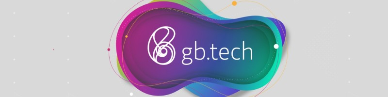
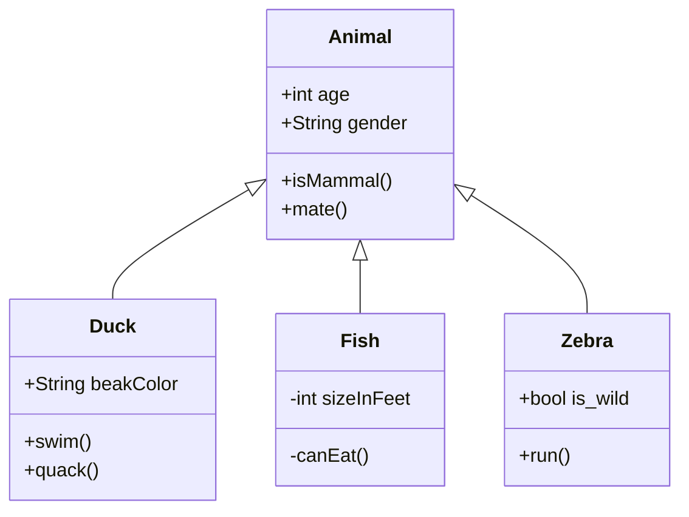

# [Sample] Index documentation

## Diagram

<html>
   

    

```mermaid
      classDiagram
        Animal <|-- Duck
        Animal <|-- Fish
        Animal <|-- Zebra
        Animal : +int age
        Animal : +String gender
        Animal: +isMammal()
        Animal: +mate()
        class Duck{
          +String beakColor
          +swim()
          +quack()
        }
        class Fish{
          -int sizeInFeet
          -canEat()
        }
        class Zebra{
          +bool is_wild
          +run()
        }
```

```plantuml
@from_file:diagrams/diagram.puml
```

   

</html>
